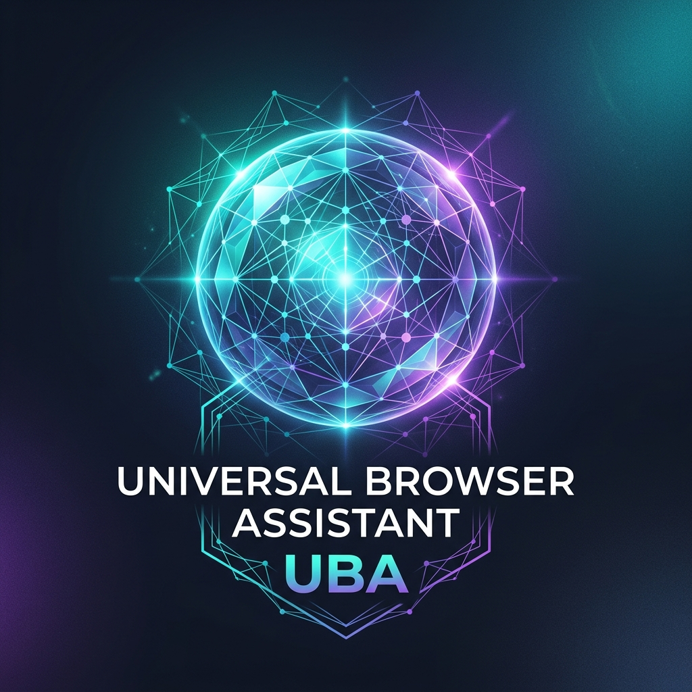
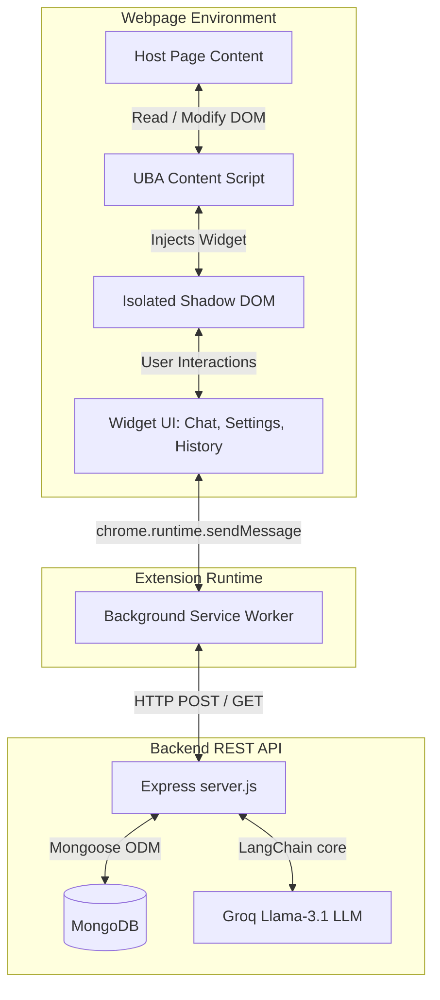

<p align="center">
  
</p>

<h1 align="center">Universal Browser Assistant (UBA)</h1>

<p align="center">
  <strong>A premium, AI-powered multilingual browser assistant that works dynamically on any website.</strong>
</p>

<p align="center">
  
  
  
  
  
</p>

---

## 🌟 Overview

**Universal Browser Assistant (UBA)** is a state-of-the-art browser extension widget that injects a context-aware AI chat sidebar into any website. Powered by a local Node.js Express server communicating with LLMs (e.g., Llama-3.1 via Groq), UBA is designed to help users instantly summarize page content, query context, perform web searches, and even translate entire web pages in-place into multiple Indian regional languages.

The extension is designed with a premium, glassmorphism UI overlay isolated inside a **Shadow DOM** to prevent stylesheet clashes with host websites.

---

## 🚀 Key Features

*   **Context-Aware Chat:** Automatically reads webpage text and highlights to provide relevant answers, summaries, and initial proactive suggestion chips.
*   **Highlight-to-Ask (Web Search):** Highlight text on any page and open the assistant (or use `Ctrl+Shift+A`) to instantly trigger a query or web search for that text.
*   **Full Page Translation:** Dynamically translates the main text content of any website in-place into popular Indian regional languages (Hindi, Telugu, Tamil, Bengali, Marathi, Kannada, Malayalam, Gujarati, Punjabi) and allows restoring the page in a single click.
*   **Speech & Voice Input:** Hands-free voice typing using the built-in web speech recognition system, and synthesized text-to-speech reading response playback.
*   **Neural Dark & Glass Light Themes:** Beautifully crafted modern appearance themes built to blend in with your browsing environment.
*   **Persistent & Synced History:** Secure registration and login to sync your conversations by domain across devices.

---

## 📐 System Architecture

The following diagram illustrates how UBA's components interact:



---

## 📂 Repository Structure

```
universal-browser-assistant/
├── assets/                     # Branding assets (logos, screenshots)
│   └── logo.png
├── backend/                    # Express REST API Server
│   ├── src/
│   │   ├── controllers/       # Route request handlers
│   │   ├── middleware/        # Authentication middlewares
│   │   ├── models/            # MongoDB schema models (User, History)
│   │   ├── routes/            # Express route endpoints
│   │   └── services/          # LangChain pipeline configurations
│   ├── .env                    # Environment variables
│   ├── server.js              # Server entrypoint
│   └── package.json
├── extension/                  # Chrome Extension Package
│   ├── assets/                # Local extension assets
│   ├── widget/                # Widget HTML, CSS, and UI Script
│   │   ├── index.html
│   │   ├── script.js
│   │   └── style.css
│   ├── background.js          # Manifest V3 service worker
│   ├── content.js             # Content script injecting Shadow DOM
│   └── manifest.json          # Chrome Extension Manifest V3
├── CONTRIBUTING.md            # Contribution Guidelines
├── LICENSE                    # MIT License
└── README.md                  # Project Documentation
```

---

## 🛠️ Installation & Setup

### Prerequisites

*   [Node.js](https://nodejs.org/) (version 18 or higher recommended)
*   [MongoDB](https://www.mongodb.com/) (running locally or via MongoDB Atlas)
*   [Groq API Key](https://console.groq.com/) (for Chat and Translation models)

---

### 1. Backend Server Setup

1.  Navigate to the `backend` folder:
    ```bash
    cd backend
    ```
2.  Install dependencies:
    ```bash
    npm install
    ```
3.  Configure your environment variables. Create a `.env` file in the `backend/` directory:
    ```env
    PORT=3000
    GROQ_API_KEY="your-groq-api-key"
    MONGO_URI="mongodb://localhost:27017/uba_assistant"
    JWT_SECRET="your-jwt-secure-secret-key"
    ```
4.  Start the database server and run the backend API server:
    *   **Development mode (using nodemon):**
        ```bash
        npm run dev
        ```
    *   **Production mode:**
        ```bash
        npm start
        ```

The server should now be running at `http://localhost:3000`. You can verify by visiting `http://localhost:3000/health`.

---

### 2. Chrome Extension Installation

1.  Open Google Chrome and navigate to `chrome://extensions/`.
2.  Enable **Developer mode** (toggle switch in the top right corner).
3.  Click **Load unpacked** in the top left corner.
4.  Select the `extension/` folder in this repository.
5.  UBA is now active! The floating assistant button (✦) will appear in the bottom-right corner of any web page you visit.

---

## ⚡ How to Use

*   **Open / Close Widget:** Click the floating (✦) button or press `Ctrl + Shift + A`.
*   **Contextual Queries:** Once opened, type any message. The AI is fed the active page context (up to 3,000 characters) and will answer based on it.
*   **Proactive Suggestions:** When you load a new page, UBA analyzes it and presents 3 suggestion chips. Click any chip to start the chat instantly.
*   **Translate Page:**
    1. Go to Settings (💎 icon inside the widget).
    2. Choose an Indian regional language (e.g. Hindi, Telugu, Marathi).
    3. Click **🌐 Translate Page**. The content translates in place.
    4. Click **🔄 Restore** to switch back to the original text.
*   **Save/Sync History:** Register or Log in via the Settings tab to sync and review your past queries for the active domain.

---

## 📡 API Endpoints

All endpoints are hosted under `http://localhost:3000/api`.

| Method | Endpoint | Description | Auth Required |
|:---|:---|:---|:---|
| **POST** | `/auth/register` | Register a new account | No |
| **POST** | `/auth/login` | Log in and receive JWT token | No |
| **POST** | `/chat/` | Send a query to the AI assistant | Yes |
| **POST** | `/chat/translate-bulk` | Bulk translate text items | Yes |
| **POST** | `/history/save` | Save a query-response pair | Yes |
| **GET** | `/history/:domain` | Retrieve interaction history by site domain | Yes |

---

## 🛡️ License

This project is licensed under the MIT License - see the [LICENSE](LICENSE) file for details.

---

## 🤝 Contributing

Contributions are welcome! Please check out [CONTRIBUTING.md](CONTRIBUTING.md) to get started.
